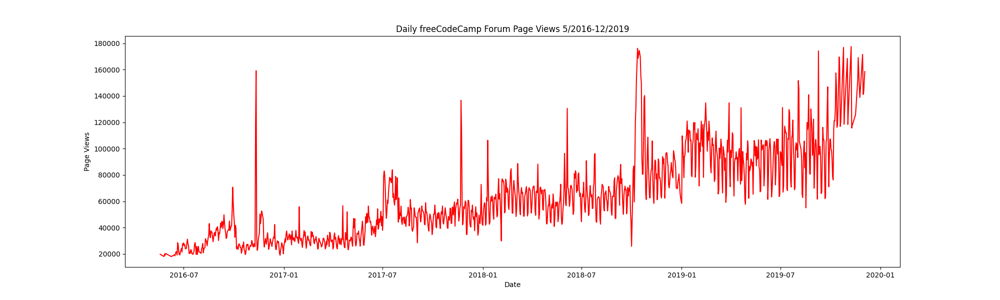
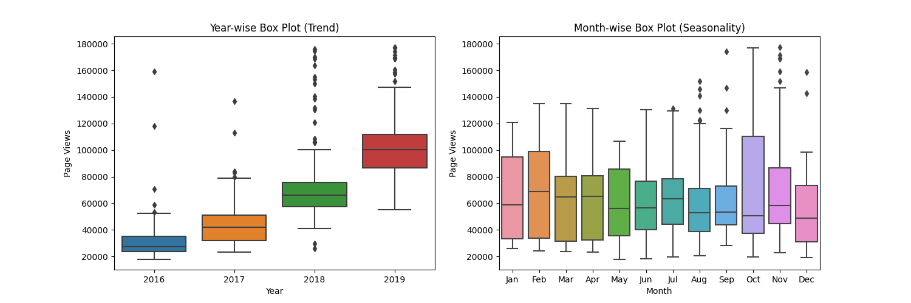

# Page View Time Series Visualizer

This project is part of the **FreeCodeCamp Data Analysis with Python** certification. The goal of the project is to visualize time series data of daily page views on a forum using Matplotlib, Pandas, and Seaborn.

The project demonstrates skills in data cleaning, data wrangling, and creating different types of plots to reveal trends and patterns in the dataset.

---

## Project Description

The dataset used contains daily page views from **May 2016 to December 2019**.
The tasks included:

* Cleaning the data by removing outliers.
* Creating a **line plot** to show the daily page views over time.
* Creating a **bar plot** to show average monthly page views per year.
* Creating **box plots** to visualize trends across years and months.

---

## Technologies Used

* `Python`
* `Pandas`
* `Matplotlib`
* `Seaborn`
* `NumPy`

---

## Example Visualizations

Line plot:


Bar plot:


Box plots:


---

## How to Run

1. Clone this repository:

   ```bash
   git clone https://github.com/RitaGr/boilerplate-page-view-time-series-visualizer.git
   ```
2. Navigate into the project folder:

   ```bash
   cd boilerplate-page-view-time-series-visualizer
   ```
3. Install dependencies (preferably in a virtual environment):

   ```bash
   pip install -r requirements.txt
   ```
4. Run the main script:

   ```bash
   python main.py
   ```

---

## Skills Demonstrated

* Data cleaning and outlier handling
* Time series analysis
* Data visualization with multiple chart types
* Professional project structure with testing

---
